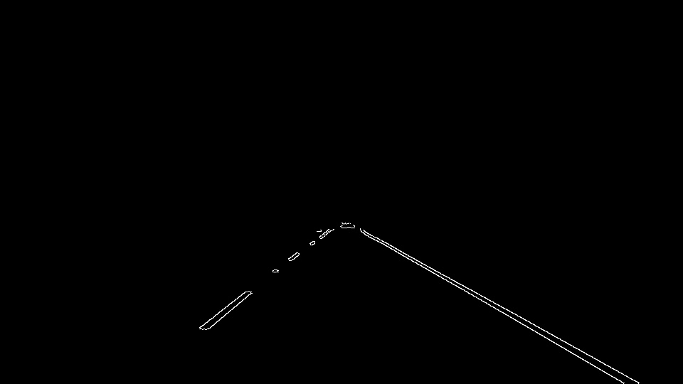
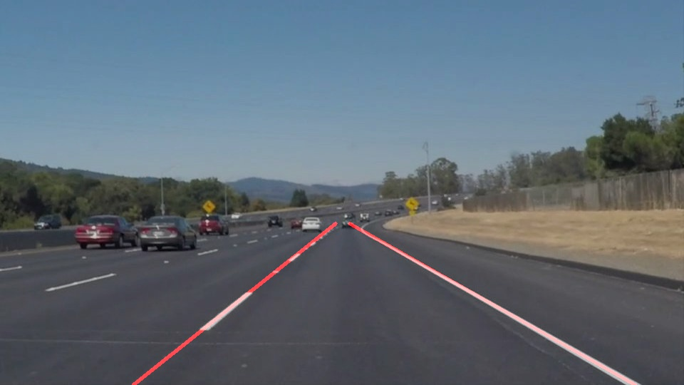

#**Finding Lane Lines on the Road** 
####Ashutosh Singh 

---

**Finding Lane Lines on the Road**

The goals / steps of this project are the following:
* Make a pipeline that finds lane lines on the road
* Reflect on your work in a written report

[//]: # (Image References)

[image1]: ./examples/grayscale.jpg "Grayscale"

---

### Reflection

###1. Describe your pipeline. As part of the description, explain how you modified the draw_lines() function.

The pipeline consists of following steps. Each step was discussed in part 

1. Grayscale Conversion : The images were converted to grayscale so as to limit the channels to work upon
so the computation is faster and also since the canny edge detector takes input a grayscale image. 

2. Gaussian Blur : The grayscale image is then smoothed using a guassian function which helps in smoothing the edges
which we find in next step. This also removes some unneccessary edgepoints. 

3. Edge Detection : Canny edge detection was used for this as this is one of the best and fastest edge detectors. 
hyper-parameters were chosen with experimentation of different values.

4. Region of Interest segmentation : From the edge points image, only a part of the image is selected in which the lanes 
are expected to be found. This is a trapezoidal area from the middle of the image extending to the end of the image. 

5. Line segment Search : From the edge points image of Step 4, hough lines transformation was used to find the line
segments using the openCV function. *rho* resolution is chosen as 1 so that all the space is checked for lines and 
the *theta* resolution is also chosen as 1 degree. Other hyper parameters were emprirically found to be giving good result 

6. Line Drawing : After we get the line segments from Step 5, These line segments are then divided into two grouds, the 
left and the right based on the slope of each of the line segments. Some of the line segments are removed which have 
slope values less than 0.5 and greater than 10 as they will form a horizontal or vertical lines. 

Then each group is averaged to extract a single slope and a single centre point. Using this centre point and slope
the the extreme points for the line are found, the bottom point will be at the image end and the top point is at about 
half of image height as used in the ROI selection step. Then these extreme points are joined by line and rendered on the 
original image. 

###2. Identify potential shortcomings with your current pipeline

Following are the potential shortcomings of the current version

1. The lines are straight and cannot follow along the curve of the lane lines. 
2. If there is some vehicle in the region of interest then it may make bump the lines group a little. 
3. The assumption is that there are only lane lines in the region of interest, If there are any other markings then 
they may break the process. 

###3. Suggest possible improvements to your pipeline

Following improvements can be done to improve the process 

1. Use some curvature finding to map the curving lanes to curved lines 
2. Use some color threshold for the yellow line so that other objects on the road (like shadows of trees)

References : 

1. [OpenCV 3 documentaion](http://docs.opencv.org/3.0-beta/modules/refman.html)
2. Udacity's Q & A Session on P1
